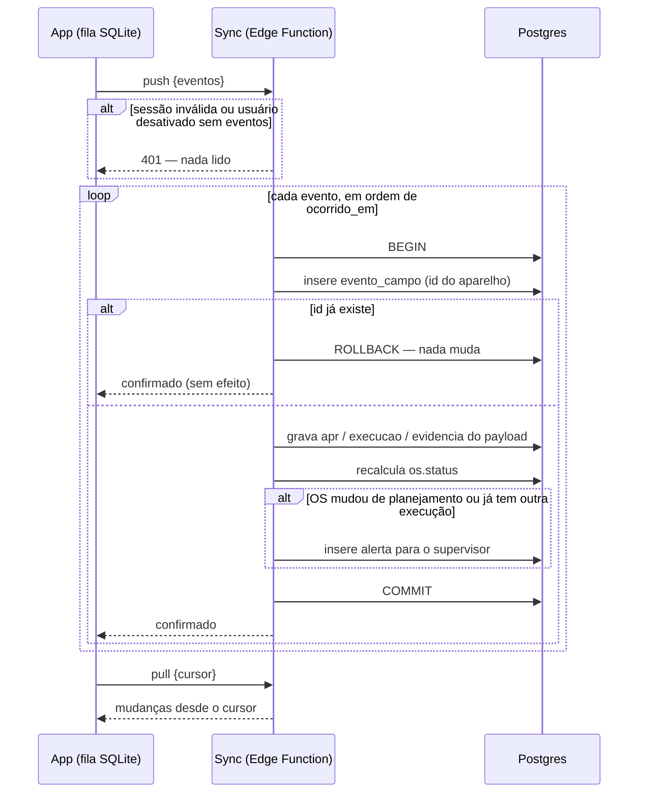
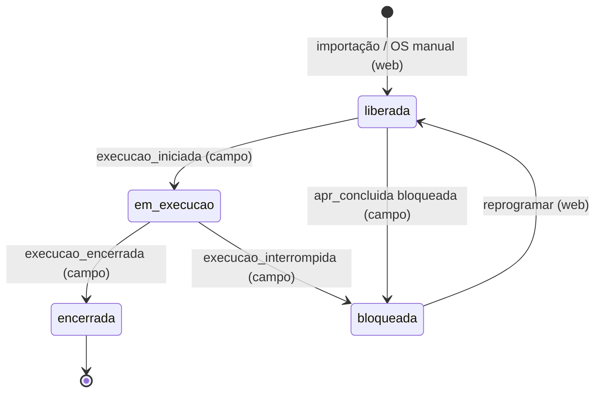
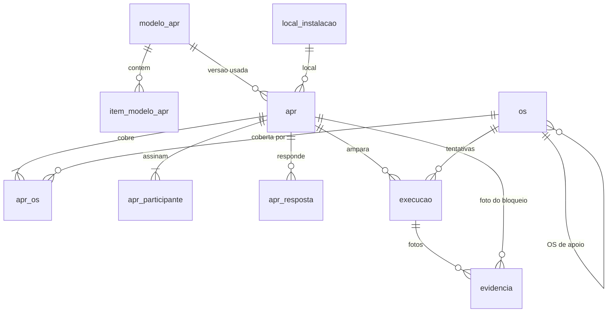

# APR e OS digitais — D.A.P.R.O.M

> Planeje a partir deste documento. Cada fatia abaixo traz o próprio formato — copie, não re-derive.
> Status: confirmado por Renan Felliphe, 2026-10-03 — decisão de construir já assumida pelo Desafio 4 da Maratona TIVIT–RPV (mentores Iago Raich e Mario Stevan) e pela Reunião 1.

## Situação

- Projeto: em construção — nada implementado; o repositório contém só o desafio, a transcrição, as notas e os modelos de APR/OS em `base/`.
- Decisão: assumida pelo Desafio 4 ("tornar a APR e a OM 100% digitais, da criação à execução", mobile Android + web) e pela decisão da Reunião 1: digitalizar a OS com assinatura, fotos, PDF e armazenamento, sem API com o SAP.
- Em andamento: copia do site de controle já existente (Lovable) a ideia de importar o relatório exportado do SAP e os filtros por equipe/status; o próprio site, o BI que a ES Gás está construindo e o SAP ficam fora e não são tocados.
- O que está em jogo: protótipo de maratona para o próximo encontro presencial (~2 semanas) — errar custa refazer partes do protótipo, não dados de produção; a exceção é o contrato de sincronização, que fica caro de mudar assim que houver celulares com fila pendente.

## Problema

A OS (no SAP, "Ordem de Manutenção"/OM) é impressa, separada por equipe, preenchida à mão em campo com a APR grampeada e depois escaneada e anexada no SAP pelo Iago. Isso ocupa de 4 a 5 pessoas, consome impressora e tinta, e devolve documentos sujos, incompletos ou ilegíveis que dificultam auditoria. Pior: nada impede um gazista de começar o serviço sem a APR, ou com uma resposta negativa num item crítico. Os indicadores que gerência e diretoria acompanham (preventivas atrasadas com e sem justificativa) dependem de alguém consolidar papel e planilha, e a demanda de clientes e ativos está crescendo.

Volume: ~390 OS encerradas no mês passado, variando de ~200 a 409 por mês (Reunião 1, relatado pelo Iago); 232 só da manutenção civil/laboratório/instrumentação em setembro de 2026. Horas-homem gastas na digitalização: não medidas — o relato é "4 a 5 pessoas".

## Sucesso

- Deu certo se: num piloto com uma equipe, 100% das OS encerradas têm uma APR aprovada registrada antes do início da execução e nenhuma OS dessa equipe passa por impressão ou scanner; na demo, o caminho importar → sincronizar → APR → executar → PDF roda num Android em modo avião e chega ao painel web quando o sinal volta.
- Sinal de que está dando errado: a fila offline não sincroniza de forma confiável até o meio do prazo (sem isso não há demo do caso de campo), ou os técnicos do piloto voltam ao papel "porque é mais rápido" — sinal de que a APR sequencial está longa demais.
- Revisão: próximo encontro presencial da maratona — Iago Raich e Mario Stevan.

## Escopo

Dentro: importação do export do SAP e criação manual de OS; app Android offline (login, OS da equipe, APR sequencial com bloqueio, execução com fotos e assinatura, interrupção); sincronização; PDF da OS executada; alertas de bloqueio no painel e por e-mail; reprogramação e OS de apoio; painel web com quadro por status, histórico, criticidade e indicadores; editor versionado de modelos de APR; gestão de usuários, perfis e equipes; planilha de encerradas para baixa manual no SAP.

Fora: escrita no SAP — não existe API (Reunião 1). MFA/SSO — RFC em [Usuário e Equipe](#usuário-e-equipe). Vínculo dispositivo–usuário — RFC, mesma slice. Push notification no celular — a OS nova chega na próxima sincronização. iOS — o desafio é para Android. Cadastro de equipamentos como entidade — o histórico usa o texto de equipamento que vem do SAP. Substituir o BI ou o site Lovable — são de outra equipe.

Não muda: SAP (continua gerando, liberando e encerrando as ordens); site Lovable de controle; o conteúdo das APRs continua sendo da segurança do trabalho.

## Formato

O registro central é a OS importada do SAP; cada tentativa de executá-la é uma Execução, amparada por uma APR que pode cobrir várias OS do mesmo local. O app Android trabalha offline sobre uma cópia dos dados da equipe e devolve ao servidor eventos de campo idempotentes, enquanto a web planeja, acompanha e exporta para o SAP. A decisão de difícil volta é o contrato de sincronização junto com a divisão de posse campo/web: mudá-lo depois de haver aparelhos com fila pendente exige migrar dados em celulares que não controlamos. A alternativa mais pesada, um motor de replicação genérico com mesclagem campo a campo, só compensa se campo e web passarem a editar o mesmo dado offline, e a Decisão-chave 2 impede exatamente isso.

## Decisões-chave

1. **App Android nativo em React Native (Expo) com SQLite local, web em React separada, e um único backend Supabase (Postgres, Auth, Storage, Edge Functions).** Escolhido por robustez offline e por ser "app de verdade" no Android, em vez de um PWA único; o PWA voltaria a ganhar se o time não conseguir sustentar dois codebases até a demo. Supabase é a escolha padrão adotada para o backend, porque elimina a escrita de auth, storage e API para um time de maratona.
2. **O campo é dono da execução e a web é dona do planejamento; a sincronização nunca descarta dado de campo.** Campo grava APR, respostas, participantes, Execução, evidências e assinaturas; web grava equipe, datas programadas, prioridade, criticidade e modelo de APR da OS. Quando um evento de campo chega para uma OS que a web mudou nesse meio-tempo (reatribuída, reprogramada, outra equipe já executou), ele é aplicado mesmo assim e gera um `alerta` para o supervisor — conflito vira alerta, nunca sobrescrita.
3. **Todo registro de campo nasce com ID gerado no aparelho, e reenviar não tem efeito; o `status` da OS é derivado no servidor, nenhum cliente o grava direto.** Isso torna a fila offline segura contra reenvio, queda no meio do envio e duplo toque no "Sincronizar". As transições ficam no diagrama de [Sincronização](#sincronização).
4. **Nenhuma Execução começa sem uma APR `aprovada` que cubra aquela OS, e uma APR `bloqueada` é imutável.** É o invariante que responde ao "serviço começar sem análise de risco" do desafio. Uma nova tentativa exige uma APR nova; o registro do bloqueio fica para auditoria e para o indicador de atraso justificado.
5. **O bloqueio é definido por item no modelo: cada item tem `resposta_bloqueante` (sim, nao ou nenhuma) e `tipo` (eliminatorio ou alerta).** Por isso "Existe algum impedimento?" bloqueia no Sim, "iluminação auxiliar" é alerta e as medidas preventivas cuja resposta esperada varia não travam. O app aplica a regra em sequência: o item seguinte só libera depois do atual, e uma resposta bloqueante encerra a APR na hora.
6. **Um modelo de APR publicado é imutável; editar cria versão nova, e toda APR aponta para a versão exata que respondeu.** APRs antigas e PDFs continuam reproduzíveis depois que a segurança do trabalho revisa um modelo, e uma APR preenchida offline numa versão anterior é aceita com a versão que usou.
7. **Uma APR cobre N OS da mesma `local_instalacao`, do mesmo código de modelo, no mesmo dia; cada Execução aponta para a sua APR.** Assim a equipe não repete o checklist para cada preventiva da mesma estação, e cada OS mantém a ligação com a análise de risco que a liberou.
8. **O SAP é só fonte e destino de planilha: a importação insere ou atualiza por `numero_ordem` tocando só colunas de planejamento, e a saída é PDF mais planilha de encerradas para baixa manual.** Reimportar nunca reabre uma OS já encerrada no app nem apaga execução de campo.

## Trabalho

| Fatia | Entrega | Status |
|---|---|---|
| [Usuário e Equipe](#usuário-e-equipe) | perfis, equipes, login online e offline | aberta — 2 suposições adotadas; 2 RFC fora da demo |
| [Importação SAP](#importação-sap) | OS entram por planilha do SAP ou cadastro manual | aberta — 2 suposições adotadas |
| [Modelo de APR](#modelo-de-apr) | editor versionado e os 8 modelos de `base/` cadastrados | aberta — 1 suposição adotada |
| [Sincronização](#sincronização) | download dos dados da equipe e envio idempotente da fila offline | definida |
| [APR](#apr) | checklist sequencial offline com bloqueio | definida |
| [Execução](#execução) | execução com fotos, assinatura, interrupção e PDF | definida |
| [Impedimento](#impedimento) | alerta ao supervisor, reprogramação e OS de apoio | aberta — 2 suposições adotadas |
| [Painel](#painel) | quadro, histórico, criticidade, indicadores e exportação SAP | aberta — 1 suposição adotada |

Ordem: Usuário e Equipe → Importação SAP → Modelo de APR (só a carga inicial) → Sincronização → APR → Execução → Impedimento → Painel → Modelo de APR (editor). Sincronização é o maior risco de prazo e vem antes das telas de campo; o editor de modelos fica por último porque a carga inicial já destrava a demo.

Derivável do repositório, fica para o plano: textos de erro, ordenação de listas, máscaras de data/hora em pt-BR e layout das telas — não há código ainda; o primeiro CRUD (Usuário e Equipe) fixa a convenção e os demais seguem como ele.

### Usuário e Equipe

**Entrega** cadastro de usuários e equipes na web, com perfis, e login no app que continua funcionando sem sinal. **Status: aberta.**

| Estado | O que deve acontecer | O que o usuário vê |
|---|---|---|
| Admin cria usuário | usuário com matrícula única, perfil e equipe | `201` |
| Matrícula repetida | nada é gravado | `409` "Matrícula já cadastrada" |
| Primeiro login no aparelho | exige sinal; o app guarda a sessão e os dados da equipe | `200` |
| Login sem sinal, já logou neste aparelho em até 7 dias | entra com a senha conferida localmente | app abre na lista de OS |
| Login sem sinal, passou de 7 dias ou nunca logou aqui | recusado | "Conecte-se para entrar" |
| Usuário desativado enquanto estava offline | a fila pendente ainda sobe na próxima sincronização; depois a sessão é revogada | "Acesso revogado" após enviar |
| Logout com fila pendente | recusado | "Há N registros não enviados" |
| Dupla em campo | o segundo participante assina no aparelho de quem está logado, sem login próprio | lista de participantes vinda da equipe |

`POST /usuarios` `{nome, matricula, email, perfil, equipe_id}` → `201` `{id}`
`POST /equipes` `{nome, centro_trabalho, supervisor_id, modelo_apr_codigo}` → `201` `{id}`

Tabelas `equipe`, `usuario`.

| Coluna | Tipo | Nulo | Referência | Nota |
|---|---|---|---|---|
| `equipe.id` | uuid | não | | |
| `equipe.nome` | text | não | | ex.: Serviços Especiais, Instrumentação, Atendimento Residencial |
| `equipe.centro_trabalho` | text | não | | código SAP (`SERV_ESP`); unique; usado pela importação |
| `equipe.supervisor_id` | uuid | sim | `usuario.id` | destinatário dos alertas; sem supervisor, os alertas vão aos analistas ativos (ver [Impedimento](#impedimento)) |
| `equipe.modelo_apr_codigo` | text | sim | | modelo padrão das OS da equipe (`APR 03`) |
| `usuario.id` | uuid | não | | = id do Supabase Auth |
| `usuario.nome` | text | não | | |
| `usuario.matricula` | text | não | | unique |
| `usuario.email` | text | sim | | obrigatório para supervisor (alertas) |
| `usuario.perfil` | text | não | | `tecnico` \| `supervisor` \| `analista` \| `seguranca` \| `admin` |
| `usuario.equipe_id` | uuid | sim | `equipe.id` | |
| `usuario.ativo` | boolean | não | | padrão true |

Perfis: `tecnico` usa o app; `supervisor` reprograma e cria OS de apoio para a sua equipe e recebe os alertas dela (é o perfil de gestão na web — não confundir com o `encarregado` que lidera a APR em campo); `analista` importa, exporta e vê tudo; `seguranca` edita modelos de APR; `admin` gerencia usuários e equipes.

1. Janela de login offline — 7 dias desde o último login online.
2. Funções de campo (gazista, instrumentista, eletricista) — ficam no texto da equipe e não viram perfil; perfil só controla acesso.

- RFC: MFA ou SSO corporativo (pergunta aberta da Reunião 1) — bloqueia o uso real, não a demo. Não decidido.
- RFC: vínculo dispositivo–usuário (aparelho por colaborador ou compartilhado) — muda o login offline e a revogação. Não decidido.

### Importação SAP

**Entrega** OS no sistema a partir da planilha exportada do SAP, mais criação manual na web. **Status: aberta.**

| Estado | O que deve acontecer | O que o usuário vê |
|---|---|---|
| Primeira importação | cria uma OS por linha com `status` `liberada`, equipe resolvida pelo centro de trabalho | `201` `{criadas, atualizadas, ignoradas}` |
| Reimportar a mesma ordem | atualiza só colunas de planejamento; nunca duplica (Decisão-chave 8) | conta em `atualizadas` |
| Ordem já `encerrada` ou `bloqueada` no app reaparece | planejamento atualizado; status e execução intocados | conta em `atualizadas` |
| Centro de trabalho sem equipe cadastrada | linha ignorada | listada em `ignoradas` com o motivo |
| Linha sem número de ordem | linha ignorada | listada em `ignoradas` |
| Arquivo que não é o export esperado | nada é gravado | `422` "Colunas obrigatórias ausentes: …" |
| Corretiva urgente fora do SAP | analista ou supervisor cria OS manual | `201` |
| OS manual num local que nunca veio do SAP | analista ou supervisor cadastra o local antes, no mesmo formulário da OS | `201` |
| Local com código já existente | nada é gravado | `409` "Local já cadastrado" |

`POST /importacoes` `multipart: arquivo .xlsx` → `201` `{importacao_id, criadas, atualizadas, ignoradas: [{linha, motivo}]}`
`POST /os` `{numero_ordem?, tipo, descricao, local_instalacao_id, equipe_id, data_inicio_prog, prioridade, os_origem_id?}` → `201` `{id}`
`POST /locais` `{codigo, endereco?, plus_code?, cliente?}` → `201` `{id}`

Tabelas `os`, `local_instalacao`, `importacao`.

| Coluna | Tipo | Nulo | Referência | Nota |
|---|---|---|---|---|
| `os.id` | uuid | não | | |
| `os.numero_ordem` | text | sim | | ordem SAP (`4023470`); unique quando presente; manual sem SAP fica nulo |
| `os.numero_nota` | text | sim | | nota SAP (`10006463`) |
| `os.tipo` | text | não | | `corretiva` (YBA1) \| `preventiva` (YBA2) |
| `os.tipo_atividade` | text | sim | | ex.: `Z01-Manutenção Corretiva` |
| `os.titulo` | text | não | | ex.: `DCV Desobstrução de caixa de valvula` |
| `os.descricao` | text | sim | | instruções, materiais e ferramentas |
| `os.equipamento` | text | sim | | texto do SAP; chave do histórico |
| `os.local_instalacao_id` | uuid | não | `local_instalacao.id` | |
| `os.equipe_id` | uuid | não | `equipe.id` | planejamento (web) |
| `os.prioridade` | text | sim | | como vem do SAP (`Muito alto`) |
| `os.data_inicio_prog` | date | não | | planejamento (web) |
| `os.data_fim_prog` | date | sim | | planejamento (web) |
| `os.modelo_apr_codigo` | text | não | | padrão da equipe; planejamento (web) |
| `os.status` | text | não | | derivado no servidor (Decisão-chave 3) — ver [Sincronização](#sincronização) |
| `os.os_origem_id` | uuid | sim | `os.id` | preenchido em OS de apoio |
| `os.origem` | text | não | | `importacao` \| `manual` |
| `os.exportada_sap_em` | timestamptz | sim | | preenchida pela exportação do [Painel](#painel) |
| `os.atualizada_em` | timestamptz | não | | cursor da sincronização |
| `local_instalacao.id` | uuid | não | | |
| `local_instalacao.codigo` | text | não | | unique; ex.: `VILA VELHA/REDE VILA VELHA` |
| `local_instalacao.endereco` | text | sim | | |
| `local_instalacao.plus_code` | text | sim | | |
| `local_instalacao.cliente` | text | sim | | ex.: Vale, Suzano |
| `local_instalacao.critico` | boolean | não | | padrão false; editado no [Painel](#painel) |
| `importacao.id` | uuid | não | | |
| `importacao.arquivo` | text | não | | caminho no Storage |
| `importacao.usuario_id` | uuid | não | `usuario.id` | |
| `importacao.criadas` / `atualizadas` / `ignoradas` | integer | não | | |
| `importacao.criada_em` | timestamptz | não | | |

Índices: `os(equipe_id, status)`, `os(local_instalacao_id)`, `os(atualizada_em)`.

1. Mapeamento de colunas — usar os campos do PDF da OS 4023470 (ordem, nota, tipo, centro de trabalho, local de instalação, equipamento, datas programadas, prioridade, endereço) até chegar o export que o Iago vai enviar; ajustar o mapeamento quando ele chegar.
2. Locais fora do SAP — a importação continua criando locais automaticamente pelo código; o cadastro manual existe só para a OS manual. Se o mesmo local chegar depois pelo SAP com outro código, vira um local diferente (ver [pontos-a-validar.md](pontos-a-validar.md)).

### Modelo de APR

**Entrega** modelos de APR versionados, editáveis na web pelo perfil `seguranca`, com os 8 modelos de `base/` cadastrados como carga inicial. **Status: aberta.**

| Estado | O que deve acontecer | O que o usuário vê |
|---|---|---|
| Carga inicial | APR 01–07 e 09 cadastradas como versão 1 publicada, com itens de verificação, riscos e medidas preventivas | |
| Segurança edita um modelo publicado | cria rascunho da versão seguinte; a publicada não muda (Decisão-chave 6) | `201` |
| Publicar rascunho | vira a versão usada pelas APRs novas; a anterior fica só para leitura | `200` |
| Publicar sem nenhum item eliminatório | recusado | `422` "Modelo precisa de ao menos um item eliminatório" |
| APR offline respondida na versão anterior chega | aceita, gravada com a versão que usou | |

`POST /modelos-apr/{codigo}/versoes` `{titulo, itens: [{secao, grupo, ordem, texto, resposta_bloqueante, tipo}]}` → `201` `{id, versao}`
`POST /modelos-apr/{codigo}/versoes/{versao}/publicar` → `200` `{id, versao, publicado_em}`

Tabelas `modelo_apr`, `item_modelo_apr`.

| Coluna | Tipo | Nulo | Referência | Nota |
|---|---|---|---|---|
| `modelo_apr.id` | uuid | não | | |
| `modelo_apr.codigo` | text | não | | `APR 01` … `APR 09`; unique com `versao` |
| `modelo_apr.versao` | integer | não | | |
| `modelo_apr.titulo` | text | não | | ex.: `ESPAÇO CONFINADO E TRABALHO EM ALTURA` |
| `modelo_apr.publicado_em` | timestamptz | sim | | nulo = rascunho; publicado não aceita escrita |
| `item_modelo_apr.id` | uuid | não | | |
| `item_modelo_apr.modelo_apr_id` | uuid | não | `modelo_apr.id` | |
| `item_modelo_apr.secao` | text | não | | `verificacao` \| `medida_preventiva` |
| `item_modelo_apr.grupo` | text | sim | | classificação/risco da planilha (`Veicular`, `Espaço Confinado`) |
| `item_modelo_apr.ordem` | integer | não | | ordem da pergunta no fluxo sequencial |
| `item_modelo_apr.texto` | text | não | | |
| `item_modelo_apr.resposta_bloqueante` | text | sim | | `sim` \| `nao` \| nulo (Decisão-chave 5) |
| `item_modelo_apr.tipo` | text | não | | `eliminatorio` \| `alerta` |
| `item_modelo_apr.permite_na` | boolean | não | | APR 04 tem coluna NA |

1. Critério de bloqueio da carga inicial (pergunta aberta da Reunião 1) — itens de verificação de 1 a 9 são `eliminatorio` e bloqueiam no Não; "Existe algum impedimento?" é `eliminatorio` e bloqueia no Sim; "iluminação auxiliar" e todas as medidas preventivas são `alerta`. Validar com a segurança do trabalho via Iago.

### Sincronização

**Entrega** a cópia offline dos dados da equipe no celular e o envio idempotente da fila de campo. **Status: definida.** É a decisão de difícil volta (ver Formato).

| Estado | O que deve acontecer | O que o usuário vê |
|---|---|---|
| Abrir o app com sinal | sincroniza sozinho: envia a fila e depois baixa as mudanças desde o último cursor | indicador "Sincronizado hh:mm" |
| Botão "Sincronizar" sem sinal | nada sai; a fila fica intacta | "Sem conexão — N registros pendentes" |
| Envio cai no meio | o que chegou fica aplicado; o reenvio não tem efeito (Decisão-chave 3) | pendentes diminuem só pelo que foi confirmado |
| Mesmo evento enviado duas vezes | aplicado uma vez | confirmado nas duas |
| OS reatribuída ou reprogramada na web enquanto o técnico estava offline | execução de campo aplicada; `alerta` `conflito_planejamento` (Decisão-chave 2) | técnico vê a OS já com o novo planejamento após a próxima sincronização |
| Duas pessoas executam a mesma OS offline | as duas Execuções são guardadas; vale a primeira encerrada; `alerta` `execucao_duplicada` | |
| OS removida do escopo da equipe | sai do celular na próxima sincronização, a menos que tenha execução local pendente | |
| Dados baixados por uma equipe | só OS `liberada`, `em_execucao` e `bloqueada` da equipe, modelos publicados, locais dessas OS e usuários da equipe | |

`POST /sync/pull` `{cursor?}` → `200` `{os[], locais[], modelos_apr[], usuarios[], cursor}`
`POST /sync/push` `{eventos: [{id, tipo, os_id?, payload, ocorrido_em}]}` → `200` `{confirmados: [id], alertas: [id]}`

Tipos de evento: `apr_concluida` (aprovada ou bloqueada; o payload leva a APR completa e a lista `os_ids` das OS que ela cobre), `execucao_iniciada`, `execucao_encerrada`, `execucao_interrompida`. Fotos e assinaturas sobem ao Storage antes do evento que as referencia; um evento cujo arquivo ainda não subiu continua pendente.

Tabela `evento_campo`.

| Coluna | Tipo | Nulo | Referência | Nota |
|---|---|---|---|---|
| `evento_campo.id` | uuid | não | | gerado no aparelho; PK garante a idempotência |
| `evento_campo.usuario_id` | uuid | não | `usuario.id` | |
| `evento_campo.tipo` | text | não | | ver acima |
| `evento_campo.os_id` | uuid | sim | `os.id` | |
| `evento_campo.payload` | jsonb | não | | |
| `evento_campo.ocorrido_em` | timestamptz | não | | relógio do aparelho |
| `evento_campo.recebido_em` | timestamptz | não | | relógio do servidor |

Alternativas consideradas: replicação genérica com mesclagem campo a campo — ganha se campo e web editarem a mesma coluna offline, o que a Decisão-chave 2 proíbe.

### APR

**Entrega** o checklist sequencial no celular, offline, que aprova ou bloqueia um conjunto de OS do mesmo local. **Status: definida.**

| Estado | O que deve acontecer | O que o usuário vê |
|---|---|---|
| Iniciar APR | técnico escolhe uma ou mais OS do mesmo local e do mesmo modelo para o dia (Decisão-chave 7); as OS escolhidas ficam registradas em `apr_os` | modelo publicado mais recente da OS |
| OS de locais ou modelos diferentes juntas | recusado | "APR cobre só OS do mesmo local e modelo" |
| Menos de 2 participantes ou sem encarregado | não avança (ninguém trabalha sozinho) | "Defina o encarregado e ao menos um executor" |
| Responder item | o próximo só libera depois do atual (Decisão-chave 5) | próxima pergunta |
| Resposta bloqueante em item `eliminatorio` | APR termina `bloqueada`; observação e ao menos 1 foto obrigatórias; **todas as OS em `apr_os` ficam `bloqueada`**; vira evento na fila | "Atividade impedida — supervisor será avisado" |
| Resposta bloqueante em item `alerta` | segue; o item fica marcado | aviso amarelo; aparece no PDF e no painel |
| Todos os itens respondidos sem bloqueio | APR `aprovada`, assinada pelos participantes | botão "Iniciar execução" nas OS cobertas |
| App fechado no meio | rascunho local retomado; nada sobe até concluir | "Continuar APR" |
| APR aprovada de outro dia | não cobre execução nova | exige APR nova |
| Tentar mudar uma APR bloqueada | impossível (Decisão-chave 4) | só leitura |

Tabelas `apr`, `apr_os`, `apr_participante`, `apr_resposta`. Todos os IDs nascem no aparelho.

| Coluna | Tipo | Nulo | Referência | Nota |
|---|---|---|---|---|
| `apr.id` | uuid | não | | |
| `apr.modelo_apr_id` | uuid | não | `modelo_apr.id` | versão exata (Decisão-chave 6) |
| `apr.local_instalacao_id` | uuid | não | `local_instalacao.id` | |
| `apr.preenchida_por` | uuid | não | `usuario.id` | |
| `apr.data` | date | não | | dia de validade |
| `apr.resultado` | text | não | | `aprovada` \| `bloqueada` |
| `apr.item_bloqueante_id` | uuid | sim | `item_modelo_apr.id` | obrigatório se `bloqueada` |
| `apr.observacao` | text | sim | | obrigatório se `bloqueada` |
| `apr.concluida_em` | timestamptz | não | | |
| `apr_os.apr_id` | uuid | não | `apr.id` | PK composta com `os_id` |
| `apr_os.os_id` | uuid | não | `os.id` | OS cobertas pela APR; é o que define "APR que cobre a OS" |
| `apr_participante.apr_id` | uuid | não | `apr.id` | |
| `apr_participante.usuario_id` | uuid | não | `usuario.id` | |
| `apr_participante.funcao` | text | não | | `encarregado` \| `executor`; exatamente um encarregado. Não confundir com o perfil `supervisor` |
| `apr_participante.assinatura_path` | text | não | | imagem no Storage |
| `apr_resposta.apr_id` | uuid | não | `apr.id` | |
| `apr_resposta.item_id` | uuid | não | `item_modelo_apr.id` | unique com `apr_id` |
| `apr_resposta.resposta` | text | não | | `sim` \| `nao` \| `na` |
| `apr_resposta.respondida_em` | timestamptz | não | | |

### Execução

**Entrega** o registro da execução em campo, com evidência, assinatura e interrupção, e o PDF da OS executada. **Status: definida.**

| Estado | O que deve acontecer | O que o usuário vê |
|---|---|---|
| Iniciar sem APR aprovada do dia que cubra a OS (registro em `apr_os`) | recusado (Decisão-chave 4) | "Preencha a APR antes de iniciar" |
| Iniciar | grava o início com hora do aparelho | OS "Em execução" |
| Condição de risco durante a execução | "Interromper": motivo e foto obrigatórios; Execução `interrompida` | "Atividade interrompida — supervisor será avisado" |
| Encerrar sem foto ou sem assinatura | recusado | "Foto e assinatura obrigatórias" |
| Encerrar | grava descrição da atividade, fim, fotos e assinatura do executor | OS "Encerrada (aguardando envio)" |
| Evento de encerramento chega ao servidor | PDF gerado e guardado no Storage | link do PDF na OS, no app e na web |
| Falha ao gerar o PDF | OS continua `encerrada`; nova tentativa automática | "PDF pendente" no painel |

`GET /os/{id}/pdf` → `200` `application/pdf`

O PDF reproduz o papel atual: cabeçalho da OS (como na OS 4023470), APR com todas as respostas e alertas, participantes com matrícula e assinatura, descrição da atividade, início e fim, fotos com data/hora e o código e versão do modelo de APR.

Tabelas `execucao`, `evidencia`.

| Coluna | Tipo | Nulo | Referência | Nota |
|---|---|---|---|---|
| `execucao.id` | uuid | não | | nasce no aparelho |
| `execucao.os_id` | uuid | não | `os.id` | |
| `execucao.apr_id` | uuid | não | `apr.id` | precisa estar `aprovada` |
| `execucao.executor_id` | uuid | não | `usuario.id` | |
| `execucao.inicio` | timestamptz | não | | |
| `execucao.fim` | timestamptz | sim | | |
| `execucao.resultado` | text | sim | | `encerrada` \| `interrompida`; nulo = em andamento |
| `execucao.descricao_atividade` | text | sim | | obrigatória se `encerrada` |
| `execucao.motivo` | text | sim | | obrigatório se `interrompida` |
| `execucao.assinatura_path` | text | sim | | obrigatória se `encerrada` |
| `execucao.pdf_path` | text | sim | | preenchido pelo servidor |
| `evidencia.id` | uuid | não | | nasce no aparelho |
| `evidencia.execucao_id` | uuid | sim | `execucao.id` | uma das duas referências é obrigatória |
| `evidencia.apr_id` | uuid | sim | `apr.id` | foto do bloqueio |
| `evidencia.foto_path` | text | não | | Storage |
| `evidencia.capturada_em` | timestamptz | não | | |
| `evidencia.latitude` / `longitude` | numeric | sim | | quando o GPS estiver disponível |

Alternativas consideradas: gerar o PDF no aparelho — ganha se o técnico precisar entregar o PDF ao cliente ainda em campo, sem sinal.

### Impedimento

**Entrega** o aviso ao supervisor quando a APR bloqueia ou a execução é interrompida, e as ações dele: reprogramar ou abrir OS de apoio. **Status: aberta.**

| Estado | O que deve acontecer | O que o usuário vê |
|---|---|---|
| Bloqueio ou interrupção chega ao servidor | OS `bloqueada` (no bloqueio de APR, todas as OS em `apr_os`); `alerta` `bloqueio` para o supervisor da equipe, no painel e por e-mail | e-mail com nº da OS, local, técnico, item ou motivo, observação e foto |
| Supervisor sem e-mail | só o alerta no painel | |
| Equipe sem supervisor cadastrado | um `alerta` para cada analista ativo | alerta no painel dos analistas |
| Supervisor reprograma | nova data, equipe ou justificativa; OS volta a `liberada` e exige APR nova (Decisão-chave 4) | `200` |
| Reprogramar sem justificativa | recusado | `422` "Justificativa obrigatória" |
| Precisa de outra equipe antes (caixa de válvula cheia d'água → civil drena) | supervisor cria OS de apoio para a outra equipe, ligada à original; a original continua `bloqueada` | `201` |
| OS de apoio encerrada | a original continua `bloqueada`; `alerta` `apoio_encerrado` para o supervisor da original, que então a reprograma | alerta no painel |
| OS bloqueada passa da data programada | conta como atrasada **justificada** | ver [Painel](#painel) |
| Supervisor marca alerta como lido | `lido_em` preenchido | some da lista de pendentes |

`POST /os/{id}/reprogramar` `{data_inicio_prog, equipe_id?, justificativa}` → `200` `{id, status}`
OS de apoio usa `POST /os` com `os_origem_id` ([Importação SAP](#importação-sap)).

Tabela `alerta`.

| Coluna | Tipo | Nulo | Referência | Nota |
|---|---|---|---|---|
| `alerta.id` | uuid | não | | |
| `alerta.tipo` | text | não | | `bloqueio` \| `conflito_planejamento` \| `execucao_duplicada` \| `apoio_encerrado` |
| `alerta.os_id` | uuid | não | `os.id` | |
| `alerta.destinatario_id` | uuid | não | `usuario.id` | supervisor da equipe; sem supervisor, um alerta por analista ativo |
| `alerta.detalhe` | text | não | | |
| `alerta.email_enviado_em` | timestamptz | sim | | |
| `alerta.lido_em` | timestamptz | sim | | |
| `alerta.criado_em` | timestamptz | não | | |

Tabela `reprogramacao`: `id`, `os_id` → `os.id`, `usuario_id` → `usuario.id`, `data_anterior`, `data_nova`, `justificativa` (text, not null), `criada_em`. É o histórico das justificativas que o indicador e a auditoria leem.

1. Destinatários — só o supervisor da equipe da OS; se a equipe não tiver supervisor, os analistas ativos. A cópia para a segurança do trabalho (SESMT) fica de fora até alguém pedir.
2. Fim da OS de apoio — encerrar a OS de apoio não libera a original sozinho; gera o alerta `apoio_encerrado` e a reprogramação continua manual, com justificativa.

### Painel

**Entrega** a visão web de gestão: quadro por status, histórico por local e equipamento, criticidade, indicadores e exportação para o SAP. **Status: aberta.**

| Estado | O que deve acontecer | O que o usuário vê |
|---|---|---|
| Abrir o painel | quadro com colunas `liberada`, `em_execucao`, `bloqueada`, `encerrada`; filtros por equipe, tipo, criticidade e período | |
| Supervisor | vê só a própria equipe; analista e admin veem todas | |
| Buscar por nº da ordem | detalhe: dados SAP, APR(s), execuções, fotos, PDF, alertas e reprogramações | |
| Histórico de um local ou equipamento | execuções encerradas, da mais recente para a mais antiga ("última calibração do manômetro X") | |
| Marcar local como crítico | `local_instalacao.critico` = true; OS desse local sobem no quadro e aparecem no filtro "Crítica" | `200` |
| Indicador mensal | preventivas do mês: encerradas, atrasadas justificadas (`bloqueada` ou com reprogramação após a data) e atrasadas sem justificativa (`liberada` após a data, sem reprogramação) | |
| Exportar para o SAP | planilha das OS `encerrada` ainda não exportadas, com link do PDF; marca `exportada_sap_em` | download `.xlsx` |
| Exportar de novo sem OS novas | planilha vazia | "Nenhuma OS nova para exportar" |

`GET /indicadores?mes=2026-09&equipe_id?` → `200` `{encerradas, atrasadas_justificadas, atrasadas_sem_justificativa, por_equipe[]}`
`GET /historico?local_instalacao_id&equipamento?` → `200` `{execucoes[]}`
`POST /exportacoes/sap` → `200` `.xlsx`
`PATCH /locais/{id}` `{critico}` → `200`

1. Criticidade inicial — marcar como críticos os locais que são ponto de recebimento (PR), ERP, ERS, autorizações e clientes Vale e Suzano (Reunião 1); a prioridade do SAP aparece ao lado, sem ser recalculada.

## Fontes

- `Desafio.md` e `Desafio.jpeg` — o problema e o objetivo do Desafio 4.
- `Transcricao_Reuniao1.md` — decisões, volumes, fluxo SAP, regras da APR, criticidade e indicadores.
- `Anotacoes_Reuniao1.md`, `anotacoes.md` — modo offline, status de OS, formulário sequencial.
- `novaIdeias.md` — 1 APR para várias OS, botão de sincronismo, login offline, perguntas sobre e-mail e exportação.
- `base/APR 01` … `APR 09` (.xlsx) — estrutura dos modelos: participantes, itens de verificação, riscos, medidas preventivas, PAE.
- `base/Exemplos_de_OS1.pdf` — OS 4023470 com APR 03 preenchida: campos da OS e layout do papel que o PDF reproduz.
- https://esgasplanomanutencao.lovable.app/controle — site de controle existente que importa o relatório do SAP.
