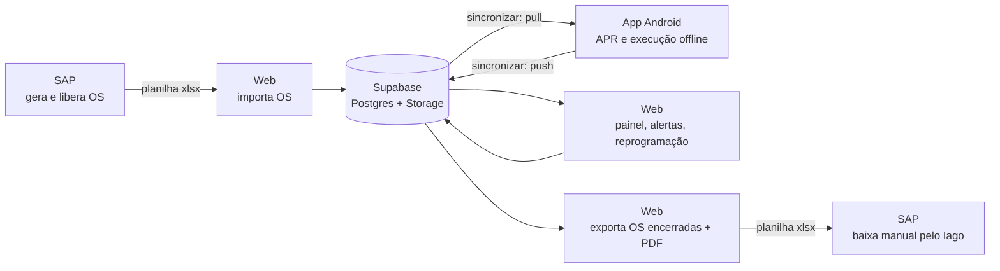
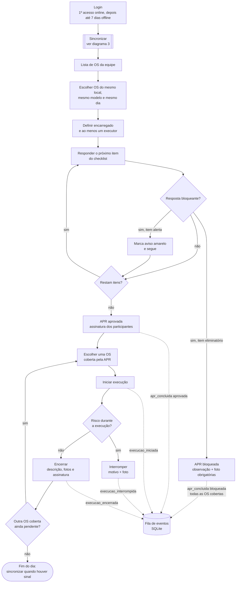
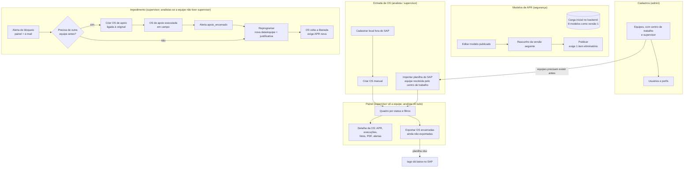
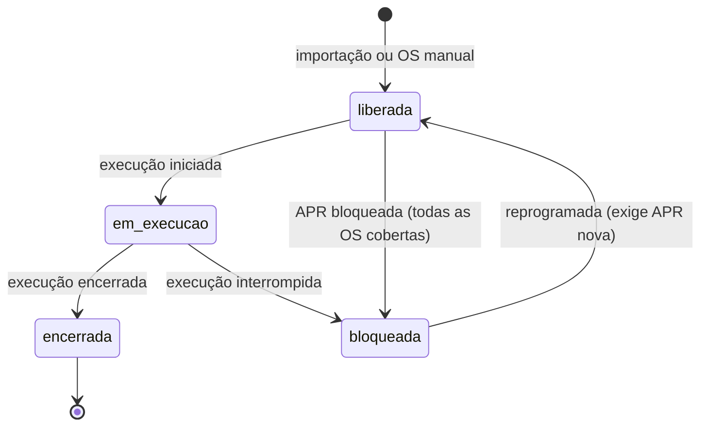

# Fluxo da solução — APR e OS digitais

> Diagramas de [apr-om-digital.md](apr-om-digital.md). Representam a especificação completa, inclusive itens que podem ficar fora do MVP (editor de modelos, OS de apoio, e-mail, alertas de conflito). Questões ainda não decididas estão em [pontos-a-validar.md](pontos-a-validar.md).

O fluxo está dividido em cinco diagramas para não cruzar setas pelo desenho inteiro:

1. [Visão geral](#1-visão-geral) — o caminho de uma OS do SAP até a baixa.
2. [Campo](#2-campo-app-android-offline) — o que o técnico faz no app, sem sinal.
3. [Sincronização e servidor](#3-sincronização-e-servidor) — como a fila chega ao banco e o que o servidor dispara.
4. [Gestão web](#4-gestão-web) — cadastros, importação, impedimentos e exportação.
5. [Ciclo de status da OS](#5-ciclo-de-status-da-os).

## 1. Visão geral



## 2. Campo (app Android, offline)

Toda ação de campo vira um evento na fila local. Nada depende de sinal até o próximo "Sincronizar".



Setas tracejadas: evento gravado na fila local. Fotos e assinaturas ficam salvas no aparelho até subirem ao Storage.

## 3. Sincronização e servidor

Uma única ação: primeiro sobem os arquivos, depois os eventos, e por último o app baixa as mudanças.

```mermaid
sequenceDiagram
  participant A as App (fila SQLite)
  participant ST as Storage
  participant S as Sync (Edge Function)
  participant DB as Postgres
  participant W as Painel web / e-mail

  alt sem sinal
    A-->>A: nada sai; fila intacta — "N registros pendentes"
  end
  A->>ST: envia fotos e assinaturas pendentes
  A->>S: push {eventos} em ordem de ocorrido_em
  loop cada evento
    alt id já recebido
      S-->>A: confirmado (sem efeito)
    else evento novo
      S->>DB: grava APR, apr_os, execução, evidências
      S->>DB: recalcula os.status
      opt APR bloqueada ou execução interrompida
        S->>DB: alerta "bloqueio"
        S->>W: alerta no painel + e-mail ao supervisor
      end
      opt execução encerrada
        S->>ST: gera o PDF da OS
      end
      opt OS de apoio encerrada
        S->>W: alerta "apoio_encerrado" ao supervisor da OS original
      end
      opt OS mudou na web enquanto estava offline / outra execução já existe
        S->>W: alerta "conflito_planejamento" ou "execucao_duplicada"
      end
      S-->>A: confirmado
    end
  end
  A->>S: pull {cursor}
  S-->>A: OS, locais, modelos e usuários da equipe alterados desde o cursor
```

Um evento cujo arquivo ainda não subiu fica pendente na fila. Reenviar um evento já confirmado não tem efeito.

## 4. Gestão web



## 5. Ciclo de status da OS

O `status` é derivado no servidor; nenhum cliente o grava diretamente.


